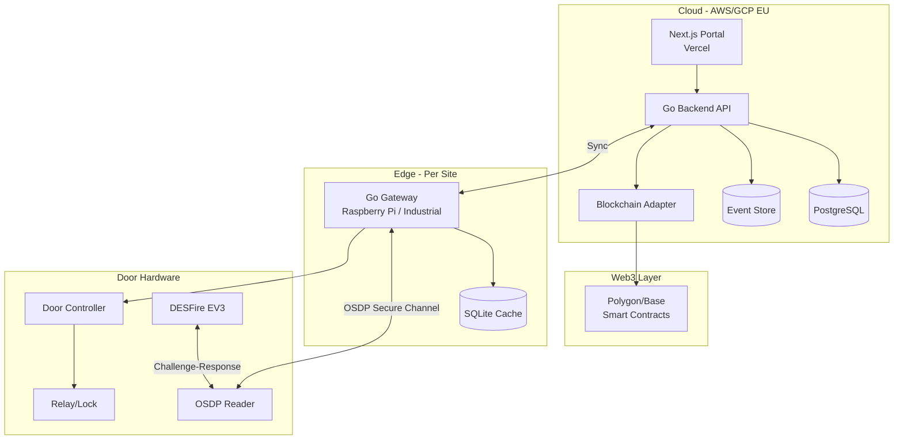
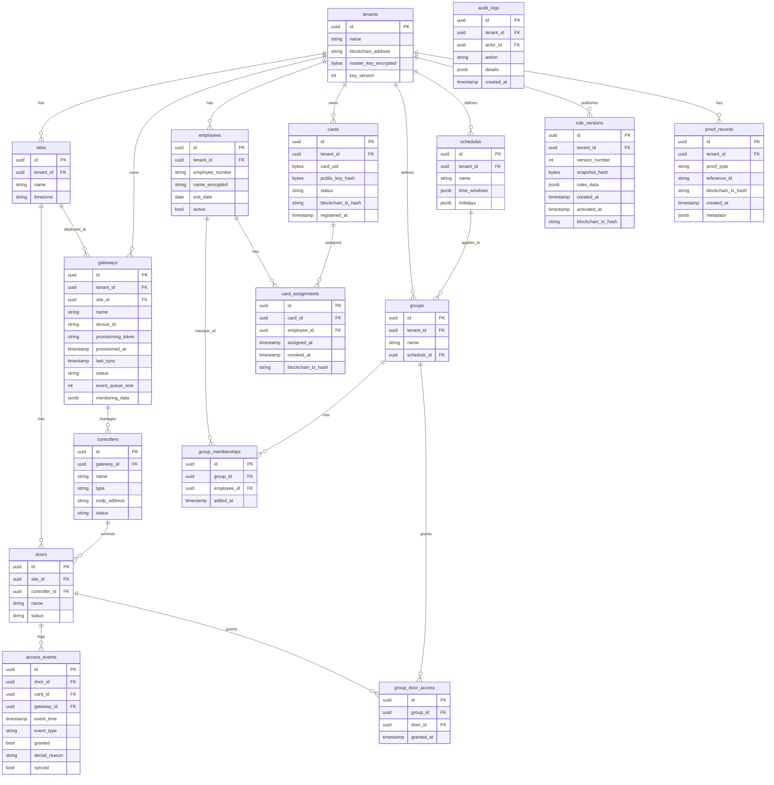
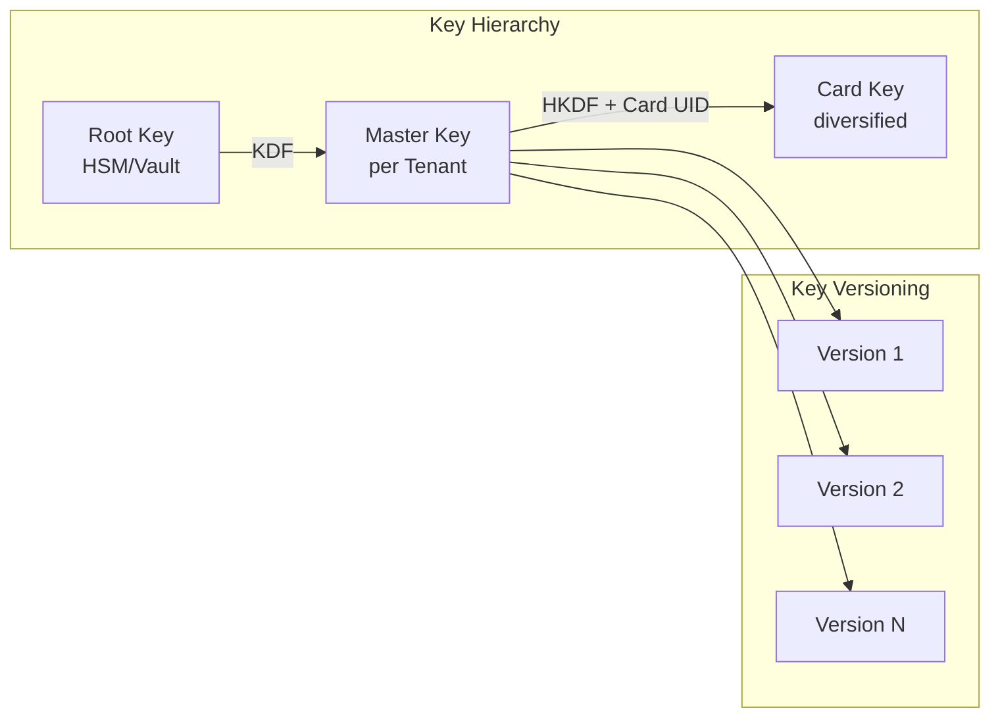
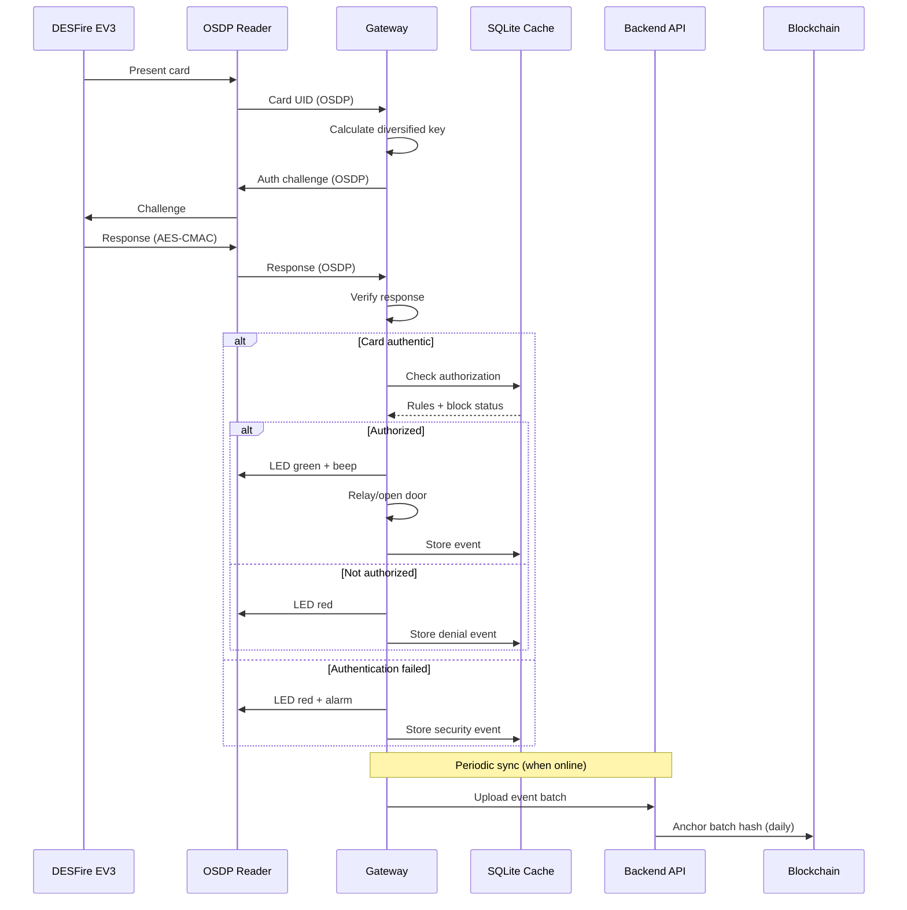

# VeryFlow Access Control System - Architecture Plan

> **Product Name:** VeryFlow (access control platform)
> **Company/Repository:** CF Card Factory (CFCardFactory)

## System Overview



## Component Architecture

### 1. Web Portal (Next.js on Vercel)

**Structure:**

```
apps/portal/
├── app/                    # Next.js App Router
│   ├── (auth)/            # Auth-protected routes
│   │   ├── dashboard/     # Status overview
│   │   ├── sites/         # Sites management
│   │   ├── gateways/      # Gateway management + QR provisioning
│   │   ├── doors/         # Doors and controllers
│   │   ├── employees/     # Employee management
│   │   ├── groups/        # Groups and schedules
│   │   ├── cards/         # Card lifecycle
│   │   ├── access-logs/   # Access events
│   │   ├── proofs/        # Proof records + export
│   │   ├── billing/       # Active cards + export
│   │   └── settings/      # Tenant settings
│   └── api/               # API Routes (BFF pattern)
├── components/
│   ├── ui/                # Shadcn/UI components
│   └── features/          # Feature-specific components
└── lib/
    ├── api-client.ts      # Backend API client
    └── auth.ts            # Clerk integration (MVP); WorkOS for enterprise later
```

**MVP Features (Phase 2):**

- Create/import/deactivate employees
- Assign/block/replace cards
- Groups and time schedules (predefined templates only)
- View/filter access events
- Audit log for admin actions

**New Features per Pflichtenheft:**

- **Gateway QR Provisioning:** Generate provisioning token, display QR code, gateway scans and registers
- **Status Dashboard:** Gateway online/offline status, last sync time, event queue size, door availability
- **Billing Export:** Count of active cards per period, CSV/JSON export for invoicing
- **Proof Export:** Filterable list of proof records, blockchain TX hash for verification

**Constraint:** No free rule engine. Only predefined access templates (Group → Door + Schedule).

### 2. Backend API (Go on AWS/GCP)

**Structure:**

```
services/backend/
├── cmd/api/               # Main entry point
├── internal/
│   ├── api/              # HTTP handlers (Chi/Echo)
│   │   ├── middleware/   # Auth, tenant, logging
│   │   └── handlers/     # REST endpoints
│   ├── domain/           # Business logic
│   │   ├── tenant/
│   │   ├── employee/
│   │   ├── card/
│   │   ├── door/
│   │   ├── access/
│   │   └── rules/
│   ├── blockchain/       # Blockchain adapter
│   │   ├── adapter.go    # Interface
│   │   ├── evm/          # EVM implementation
│   │   └── contracts/    # ABI bindings
│   ├── gateway/          # Gateway sync service
│   │   ├── sync.go
│   │   └── push.go       # Revocation push
│   └── store/            # PostgreSQL repositories
├── pkg/
│   ├── crypto/           # Key management, HKDF
│   └── osdp/             # OSDP protocol types
└── migrations/           # SQL migrations
```

**Core API Endpoints:**

- `POST /api/v1/employees` - Create employee
- `POST /api/v1/cards/register` - Register card (+ on-chain)
- `POST /api/v1/cards/{id}/issue` - Assign card (+ on-chain)
- `POST /api/v1/cards/{id}/revoke` - Block card (+ on-chain + push)
- `GET /api/v1/sync/rules` - Rules state for gateway
- `GET /api/v1/sync/blocklist` - Blocklist for gateway
- `POST /api/v1/events/batch` - Event batch from gateway

**Gateway Management Endpoints:**

- `POST /api/v1/gateways/provision` - Generate provisioning token + QR data
- `POST /api/v1/gateways/register` - Gateway self-registration (called by gateway)
- `GET /api/v1/gateways` - List gateways with status
- `GET /api/v1/gateways/{id}/status` - Detailed gateway status + monitoring

**Group and Schedule Endpoints:**

- `POST /api/v1/groups` - Create group
- `POST /api/v1/groups/{id}/members` - Add employee to group
- `POST /api/v1/groups/{id}/doors` - Grant group access to door
- `POST /api/v1/schedules` - Create schedule (predefined templates)

**Billing and Export Endpoints:**

- `GET /api/v1/billing/active-cards` - Count active cards for period
- `GET /api/v1/billing/export` - Export billing data (CSV/JSON)
- `GET /api/v1/proofs` - List proof records
- `GET /api/v1/proofs/export` - Export proofs (CSV/JSON)

### 3. Gateway (Go on Raspberry Pi / Industrial)

**Structure:**

```
services/gateway/
├── cmd/gateway/          # Main entry point
├── internal/
│   ├── provision/       # QR-based provisioning
│   │   ├── qr.go        # QR code scanning
│   │   └── register.go  # Backend registration
│   ├── osdp/            # OSDP Secure Channel client
│   │   ├── connection.go
│   │   ├── secure.go    # SCS encryption
│   │   └── commands.go
│   ├── card/            # Card validation
│   │   ├── desfire.go   # DESFire EV3 auth
│   │   └── challenge.go # Challenge-response
│   ├── access/          # Access decision engine
│   │   ├── engine.go    # Offline-capable decision
│   │   ├── rules.go     # Rules evaluation
│   │   └── schedule.go  # Schedule check
│   ├── sync/            # Cloud synchronization
│   │   ├── pull.go      # Fetch rules/blocklist
│   │   ├── push.go      # Upload events
│   │   └── offline.go   # Offline queue
│   ├── monitoring/      # Status reporting
│   │   ├── status.go    # Online status, queue size
│   │   └── diagnostics.go
│   ├── store/           # SQLite for offline cache
│   └── hardware/        # GPIO/relay control
├── pkg/
│   └── crypto/          # Key derivation, secure storage
└── configs/             # Hardware profiles
```

**Gateway Functions (per Pflichtenheft):**

- Provisioning via QR code (scan → register → receive certificate)
- Rule synchronization from backend
- Blocklist management (local cache)
- Offline decision engine
- Event buffering (local storage when offline)
- Monitoring data delivery (status, last sync, queue size)
- Signed updates only

**Critical Requirements:**

- Door decision < 300ms
- Offline operation minimum 24h without functionality loss
- Secure key storage (no plaintext)
- Signed updates
- Watchdog for system stability

### 4. Blockchain Adapter and Smart Contracts

**Adapter Interface (Go):**

```go
type BlockchainAdapter interface {
    RegisterCard(ctx context.Context, tenantID, cardID string, pubKeyHash []byte) (txHash string, err error)
    IssueCard(ctx context.Context, tenantID, cardID, employeeHash string) (txHash string, err error)
    RevokeCard(ctx context.Context, tenantID, cardID string, reason uint8) (txHash string, err error)
    AnchorRulesSnapshot(ctx context.Context, tenantID string, version uint64, hash []byte) (txHash string, err error)
    AnchorEventBatch(ctx context.Context, tenantID string, batchHash []byte, timestamp int64) (txHash string, err error)
}
```

**Smart Contract (Solidity):**

```
contracts/
├── CardRegistry.sol      # Main contract
├── interfaces/
│   └── ICardRegistry.sol
└── test/
    └── CardRegistry.t.sol
```

**On-Chain Data Structure (minimal):**

```solidity
struct CardRecord {
    bytes32 publicKeyHash;
    bytes32 employeeHash;    // No plaintext name
    uint8 status;            // 0=pending, 1=active, 2=revoked
    uint64 issuedAt;
    uint64 revokedAt;
}

struct RulesAnchor {
    uint64 version;
    bytes32 snapshotHash;
    uint64 timestamp;
}
```

## Data Model (PostgreSQL)



## Key Management (DESFire EV3)



**Principles:**

- Master key per tenant, encrypted in DB (AWS KMS / GCP KMS)
- Key Diversification: `CardKey = HKDF(MasterKey, CardUID || Version)`
- Key Versioning: Allows rotation without reprogramming all cards
- Private keys remain in DESFire chip, never extractable

## End-to-End Access Flow (Offline-capable)



## Offline Operating Model and Connectivity

VeryFlow is **offline-first at the decision point**. No permanent cloud connection is required for access decisions. The following principles are part of the formal architecture.

### No Permanent Online Required

- Access decisions (door open, card verification, cryptography) happen **entirely locally** in the gateway.
- The internet is **not** required for opening a door.
- **Periodic synchronisation** is part of the security model: gateways must sync regularly (not necessarily constantly) to receive revocations, new permissions, and rule changes. No mandatory LTE, VPN, or special link at the site.

### TTL as Core Mechanism

- Card permissions have a **time-to-live (TTL)**. **Default: 1 hour.**
- Rationale: Gateways are assumed to be online in practice. TTL is primarily a **safety net** for real offline situations, not the normal mode. Revocations and role changes should take effect quickly (within the sync window), not hours later.
- Offline duration is **controlled by TTL**, not unbounded.

### Sync Logic

- Gateway maintains an **active connection** to the backend; **push is preferred**.
- **Fallback:** Polling every **60 seconds** if push is unavailable.
- On **revocation or rule change**, the backend sends an event **immediately**; gateway **invalidates local cache immediately** and does not wait for the next poll.

### Defined Offline Operating States

The system models offline behaviour explicitly:

| State | Description | Access behaviour |
|-------|-------------|------------------|
| **Online** | Gateway in contact with backend | Normal operation; push/poll sync runs. |
| **Grace Offline** | Gateway offline; TTL of permissions not yet expired | Cache remains valid; access allowed for cards still within TTL. |
| **Restricted Offline** | Gateway offline; TTL expired | **No hard fail-closed.** Operation continues with a clearly defined **minimal-rights profile** (e.g. Admin, Technik, Security). All access events are logged as **security events**. Goal: maximum practicality without losing security assurance. |
| **Fail Secure** | Configurable per door | e.g. door remains closed when in doubt. |

**Implementation requirement:** Do not build logic that assumes permanent cloud reachability or unlimited offline operation. Offline is allowed but intentionally bounded; this is product security, not only a technical detail.

### Immediate Revocation (Sofortsperre) – Core Feature

Immediate revocation is a **core product feature**, not optional:

- **Portal:** Admin can trigger immediate lock on **card**, **person**, **door group**, or **site**.
- **Backend:** Emits a **push event** to all relevant gateways.
- **Gateway:** **Immediate cache invalidation**; no wait for next poll.
- **UI:** Shows **gateway status** for the revocation: confirmed, pending, or offline (so the admin sees which gateways have applied the lock).

## Development Phases

### Phase 1: Lab Prototype (4-6 weeks)

**Goal:** Proof of concept for the critical door path

**Scope:**

- 1 tenant, 1 door, 1 gateway, 1-5 cards
- Gateway on Raspberry Pi 4
- OSDP reader (e.g., HID Signo 20)
- DESFire EV3 challenge-response functional
- Local decision < 300ms
- Minimal admin API (no portal UI)
- Smart contract deployed on testnet
- `registerCard` and `revokeCard` on-chain

**Deliverables:**

- Gateway binary for Raspberry Pi
- Backend API (Docker)
- Smart contract + tests
- Documented test setup

### Phase 2: Pilot MVP (6-8 weeks)

**Goal:** Deployable system for first pilot customer

**Scope:**

- Offline capability production-ready (24h+)
- Sync protocol: rules pull, blocklist pull, event push
- Revocation push (immediate blocking)
- Portal MVP: employees, cards, roles, schedules, logs
- Clerk integration (MVP); WorkOS for enterprise later
- Event batch anchoring (daily)
- Signed gateway updates
- Monitoring/alerting (basic)

**Deliverables:**

- Portal on Vercel
- Backend on AWS/GCP
- Gateway image for pilot hardware
- Operations documentation

### Phase 3: Product Expansion (post-pilot)

**Scope:**

- Multi-site management
- Extended role model
- Reports and exports
- Billing integration
- Industrial gateway hardware
- Additional reader integrations
- Mobile credentials (future)

## Project Structure (Monorepo)

```
CFCardFactory/
├── apps/
│   └── portal/           # Next.js frontend
├── services/
│   ├── backend/          # Go backend API
│   └── gateway/          # Go edge gateway
├── contracts/            # Solidity smart contracts
├── packages/
│   ├── ui/              # Shared UI components
│   ├── types/           # Shared TypeScript types
│   └── proto/           # Protobuf/API definitions
├── tools/
│   ├── card-tools/      # Card personalization
│   └── gateway-tools/   # Gateway provisioning
├── docs/
│   ├── architecture/
│   ├── api/
│   └── operations/
├── docker-compose.yml   # Local dev environment
├── turbo.json           # Monorepo build config
└── README.md
```

## Technology Stack Summary

| Component | Technology | Rationale |
|-----------|------------|-----------|
| Portal | Next.js 14+, App Router, Shadcn/UI | Fast development, good DX |
| Auth | Clerk (MVP); WorkOS for enterprise; no Keycloak | Managed, Next.js–friendly; enterprise SSO later |
| Backend | Go 1.22+, Chi Router | Performance, maintainability |
| Database | PostgreSQL 16 | Robust, JSON support, proven |
| Event Store | PostgreSQL (partitioned) | Simplicity, later optionally TimescaleDB |
| Gateway | Go, SQLite | Offline-capable, resource-efficient |
| Blockchain | Polygon/Base, Solidity | EVM-compatible, low fees |
| Portal Hosting | Vercel | Optimal for Next.js |
| Backend Hosting | AWS ECS or GCP Cloud Run | EU region, scalable |
| CI/CD | GitHub Actions | Standard, well integrated |

## Security Architecture (Overview)

- **Card Authentication:** DESFire EV3 AES-128 challenge-response, no UID auth
- **OSDP Secure Channel:** Encrypted reader communication
- **Key Management:** Master key per tenant in KMS, key diversification per card
- **API Auth:** JWT via Clerk (MVP), tenant isolation at DB level
- **Gateway Auth:** mTLS to backend, device certificates
- **Updates:** Code-signed gateway updates
- **Audit:** All admin actions logged, event batches anchored on-chain

## Monitoring and Operations

| Metric | Description | Source |
|--------|-------------|--------|
| Gateway Online Status | Connected / Disconnected | Gateway heartbeat |
| Last Synchronization | Timestamp of last successful sync | Gateway reports |
| Door Status | Available / Not available | Controller status |
| Event Queue Size | Number of buffered events | Gateway local store |
| Basic Diagnostics Export | JSON/CSV diagnostic data | Gateway + Backend |

**Monitoring Endpoints:**

- `GET /api/v1/gateways/{id}/status` - Real-time gateway status
- `GET /api/v1/monitoring/overview` - Tenant-wide status dashboard
- `GET /api/v1/monitoring/diagnostics` - Export diagnostic data

## Design Constraints

### Rule Engine Limitation

> **No free rule engine. Only predefined templates.**

The system deliberately does not support arbitrary rule definitions. Access control is limited to:

- Group → Door assignments
- Schedule → Group assignments
- Time window definitions

This constraint ensures:
- Predictable behavior for auditing
- Simpler offline decision logic
- Reduced attack surface
- Easier compliance verification

### Web3 Layer Boundaries

The blockchain layer is strictly limited to:

| Allowed | Not Allowed |
|---------|-------------|
| Card issued event | Real-time access checks |
| Card revoked event | Per-access transactions |
| Rules version activated | Storing personal data |
| Event batch hash anchor | Real-time authorization |

**Principle:** Web3 is bookkeeping and notary, not door opener.

## Acceptance Criteria MVP

| Nr. | Criterion | Verification |
|-----|-----------|--------------|
| 1 | Access works offline | Disconnect gateway from network, verify access still granted |
| 2 | Blocked card cannot open door | Revoke card, verify immediate denial |
| 3 | Copied UID cannot open door | Present cloned UID without crypto auth, verify denial |
| 4 | Rules are synchronized | Change rule in portal, verify gateway receives update |
| 5 | Proof entries are created | Issue/revoke card, verify blockchain transaction |
| 6 | No on-chain costs for access | Perform 100 accesses, verify zero blockchain transactions |

## References

- **Pflichtenheft:** [PFLICHTENHEFT_MVP.md](../requirements/PFLICHTENHEFT_MVP.md)
- **German Version:** [ARCHITECTURE_PLAN_DE.md](./ARCHITECTURE_PLAN_DE.md)
