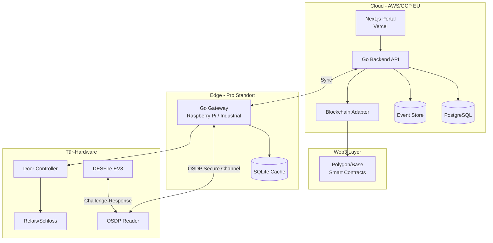
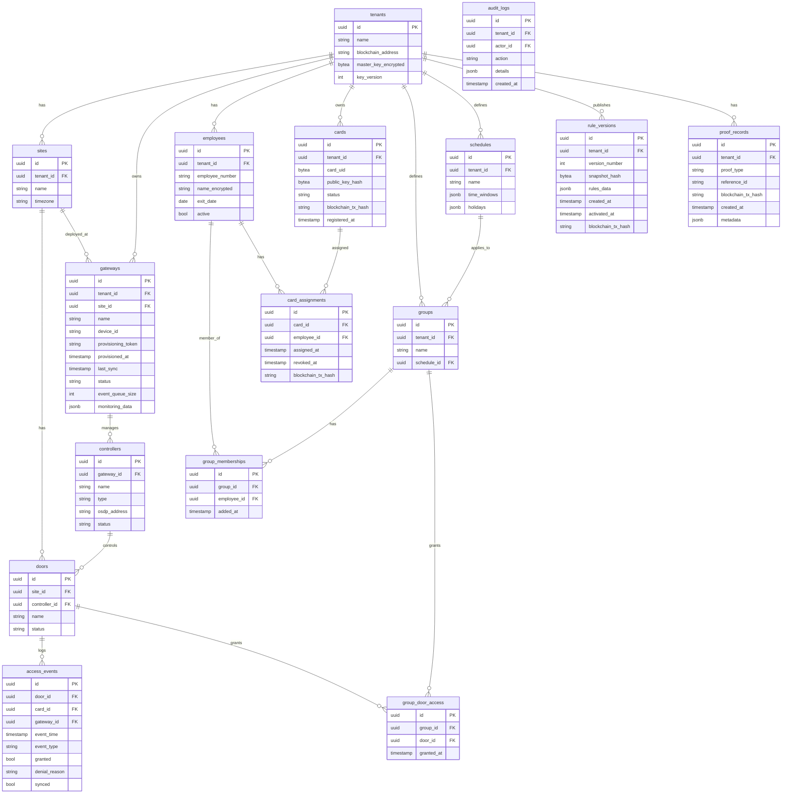
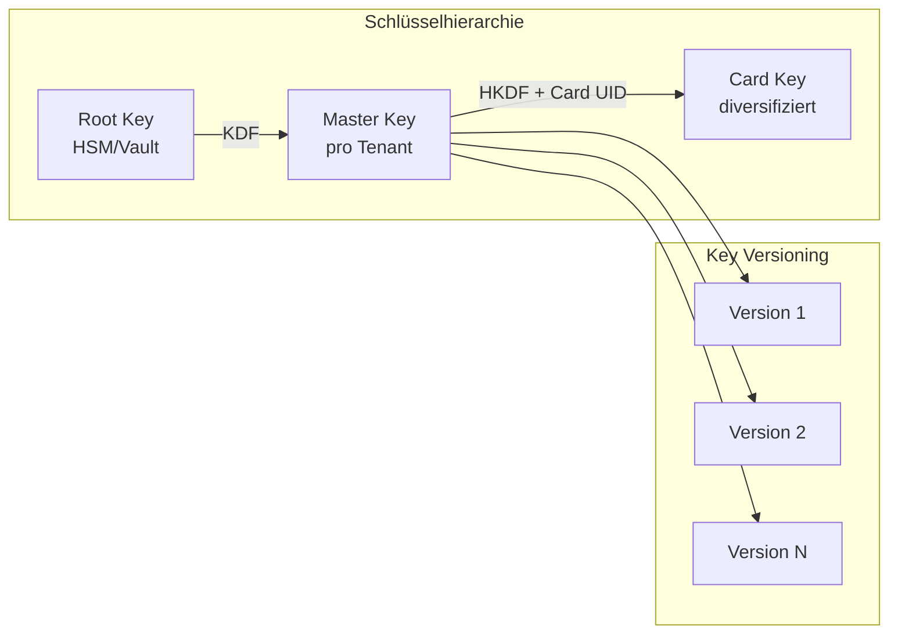
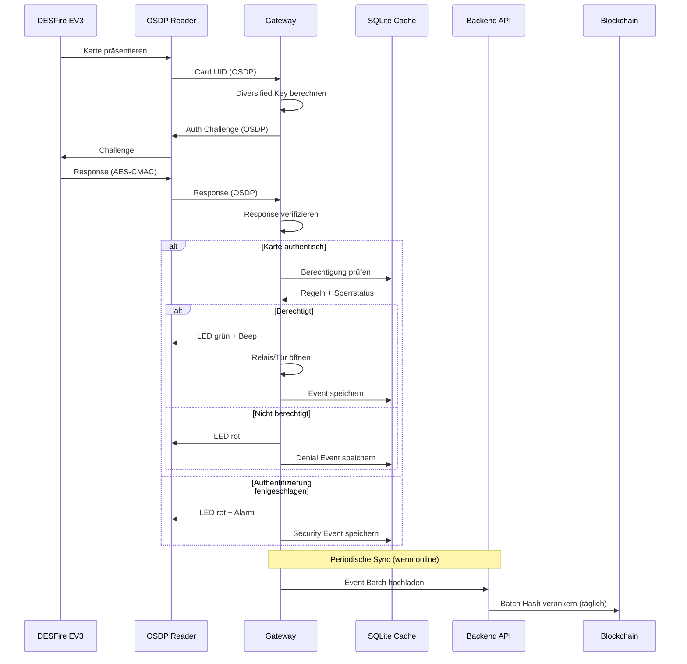

# VeryFlow Zutrittssystem - Architekturplan (Deutsch)

> **Produktname:** VeryFlow (Zutrittsplattform)
> **Firma/Repository:** CF Card Factory (CFCardFactory)

## Übersicht

Web 3.0-gestütztes Zutrittssystem mit Next.js Portal, Go Backend/Gateway, PostgreSQL, OSDP-basiertem Door Kit und EVM-kompatiblem Blockchain Layer für manipulationsresistente Nachweise.

## Aufgabenliste

| ID | Aufgabe | Status |
|----|---------|--------|
| setup-monorepo | Monorepo-Struktur mit Turborepo aufsetzen, Projektgrundgerüst erstellen | Ausstehend |
| portal-scaffold | Next.js Portal mit App Router, Shadcn/UI, Auth0/Clerk Grundintegration | Ausstehend |
| backend-core | Go Backend: API-Grundstruktur, PostgreSQL-Schema, Tenant-Middleware | Ausstehend |
| gateway-osdp | Gateway: OSDP Secure Channel Implementation, Reader-Kommunikation | Ausstehend |
| gateway-desfire | Gateway: DESFire EV3 Challenge-Response, Key Derivation | Ausstehend |
| gateway-decision | Gateway: Offline Access Decision Engine, SQLite Cache | Ausstehend |
| gateway-sync | Gateway: Cloud-Sync (Rules Pull, Blocklist, Event Push) | Ausstehend |
| smart-contracts | Solidity Smart Contracts: CardRegistry, Tests, Testnet Deployment | Ausstehend |
| blockchain-adapter | Go Blockchain Adapter: EVM Integration, Abstraktion für Chain-Wechsel | Ausstehend |
| integration-test | End-to-End Integration: Lab-Aufbau mit echter Hardware testen | Ausstehend |

---

## Systemübersicht



---

## Komponenten-Architektur

### 1. Web Portal (Next.js auf Vercel)

**Struktur:**

```
apps/portal/
├── app/                    # Next.js App Router
│   ├── (auth)/            # Auth-geschützte Routes
│   │   ├── dashboard/     # Statusübersicht
│   │   ├── sites/         # Standortverwaltung
│   │   ├── gateways/      # Gateway-Verwaltung + QR-Provisioning
│   │   ├── doors/         # Türen und Controller
│   │   ├── employees/     # Mitarbeiterverwaltung
│   │   ├── groups/        # Gruppen und Zeitpläne
│   │   ├── cards/         # Kartenlebenszyklus
│   │   ├── access-logs/   # Zutrittsereignisse
│   │   ├── proofs/        # Proof Records + Export
│   │   ├── billing/       # Aktive Karten + Export
│   │   └── settings/      # Mandanten-Einstellungen
│   └── api/               # API Routes (BFF Pattern)
├── components/
│   ├── ui/                # Shadcn/UI Komponenten
│   └── features/          # Feature-spezifische Komponenten
└── lib/
    ├── api-client.ts      # Backend API Client
    └── auth.ts            # Auth0/Clerk Integration
```

**MVP-Funktionen (Phase 2):**

- Mitarbeiter anlegen/importieren/deaktivieren
- Karte zuweisen/sperren/ersetzen
- Gruppen und Zeitpläne (nur vordefinierte Templates)
- Zutrittsereignisse anzeigen/filtern
- Audit-Log für Admin-Aktionen

**Neue Features laut Pflichtenheft:**

- **Gateway QR-Provisioning:** Token generieren, QR-Code anzeigen, Gateway scannt und registriert sich
- **Status-Dashboard:** Gateway online/offline, letzte Sync-Zeit, Event-Queue-Größe, Türverfügbarkeit
- **Billing-Export:** Anzahl aktiver Karten pro Zeitraum, CSV/JSON-Export für Abrechnung
- **Proof-Export:** Filterbare Liste aller Proof Records, Blockchain-TX-Hash zur Verifizierung

**Einschränkung:** Keine freie Regel-Engine. Nur vordefinierte Zugriffs-Templates (Gruppe → Tür + Zeitplan).

---

### 2. Backend API (Go auf AWS/GCP)

**Struktur:**

```
services/backend/
├── cmd/api/               # Main Entry Point
├── internal/
│   ├── api/              # HTTP Handler (Chi/Echo)
│   │   ├── middleware/   # Auth, Tenant, Logging
│   │   └── handlers/     # REST Endpoints
│   ├── domain/           # Business Logic
│   │   ├── tenant/
│   │   ├── employee/
│   │   ├── card/
│   │   ├── door/
│   │   ├── access/
│   │   └── rules/
│   ├── blockchain/       # Blockchain Adapter
│   │   ├── adapter.go    # Interface
│   │   ├── evm/          # EVM Implementation
│   │   └── contracts/    # ABI Bindings
│   ├── gateway/          # Gateway Sync Service
│   │   ├── sync.go
│   │   └── push.go       # Revocation Push
│   └── store/            # PostgreSQL Repositories
├── pkg/
│   ├── crypto/           # Key Management, HKDF
│   └── osdp/             # OSDP Protocol Types
└── migrations/           # SQL Migrations
```

**API-Endpunkte (Kern):**

- `POST /api/v1/employees` - Mitarbeiter anlegen
- `POST /api/v1/cards/register` - Karte registrieren (+ On-Chain)
- `POST /api/v1/cards/{id}/issue` - Karte zuweisen (+ On-Chain)
- `POST /api/v1/cards/{id}/revoke` - Karte sperren (+ On-Chain + Push)
- `GET /api/v1/sync/rules` - Regelstand für Gateway
- `GET /api/v1/sync/blocklist` - Sperrliste für Gateway
- `POST /api/v1/events/batch` - Event-Batch vom Gateway

**Gateway-Management-Endpunkte:**

- `POST /api/v1/gateways/provision` - Provisioning-Token + QR-Daten generieren
- `POST /api/v1/gateways/register` - Gateway-Selbstregistrierung (vom Gateway aufgerufen)
- `GET /api/v1/gateways` - Gateways mit Status auflisten
- `GET /api/v1/gateways/{id}/status` - Detaillierter Gateway-Status + Monitoring

**Gruppen- und Zeitplan-Endpunkte:**

- `POST /api/v1/groups` - Gruppe anlegen
- `POST /api/v1/groups/{id}/members` - Mitarbeiter zu Gruppe hinzufügen
- `POST /api/v1/groups/{id}/doors` - Gruppe Zugang zu Tür gewähren
- `POST /api/v1/schedules` - Zeitplan anlegen (vordefinierte Templates)

**Billing- und Export-Endpunkte:**

- `GET /api/v1/billing/active-cards` - Aktive Karten für Zeitraum zählen
- `GET /api/v1/billing/export` - Billing-Daten exportieren (CSV/JSON)
- `GET /api/v1/proofs` - Proof Records auflisten
- `GET /api/v1/proofs/export` - Proofs exportieren (CSV/JSON)

---

### 3. Gateway (Go auf Raspberry Pi / Industrial)

**Struktur:**

```
services/gateway/
├── cmd/gateway/          # Main Entry Point
├── internal/
│   ├── provision/       # QR-basiertes Provisioning
│   │   ├── qr.go        # QR-Code scannen
│   │   └── register.go  # Backend-Registrierung
│   ├── osdp/            # OSDP Secure Channel Client
│   │   ├── connection.go
│   │   ├── secure.go    # SCS Encryption
│   │   └── commands.go
│   ├── card/            # Card Validation
│   │   ├── desfire.go   # DESFire EV3 Auth
│   │   └── challenge.go # Challenge-Response
│   ├── access/          # Access Decision Engine
│   │   ├── engine.go    # Offline-fähige Entscheidung
│   │   ├── rules.go     # Regelauswertung
│   │   └── schedule.go  # Zeitplan-Check
│   ├── sync/            # Cloud Synchronisation
│   │   ├── pull.go      # Regeln/Sperrliste holen
│   │   ├── push.go      # Events hochladen
│   │   └── offline.go   # Offline-Queue
│   ├── monitoring/      # Status-Reporting
│   │   ├── status.go    # Online-Status, Queue-Größe
│   │   └── diagnostics.go
│   ├── store/           # SQLite für Offline-Cache
│   └── hardware/        # GPIO/Relais-Steuerung
├── pkg/
│   └── crypto/          # Key Derivation, Secure Storage
└── configs/             # Hardware-Profile
```

**Gateway-Funktionen (laut Pflichtenheft):**

- Provisioning per QR-Code (Scannen → Registrieren → Zertifikat erhalten)
- Regelsynchronisation vom Backend
- Sperrlistenverwaltung (lokaler Cache)
- Offline Decision Engine
- Event Buffering (lokale Speicherung bei Offline)
- Monitoring-Daten liefern (Status, letzte Sync, Queue-Größe)
- Nur signierte Updates

**Kritische Anforderungen:**

- Türentscheidung < 300ms
- Offline-Betrieb mind. 24h ohne Funktionsverlust
- Sichere Schlüsselablage (kein Klartext)
- Signierte Updates
- Watchdog für Systemstabilität

---

### 4. Blockchain Adapter und Smart Contracts

**Adapter-Interface (Go):**

```go
type BlockchainAdapter interface {
    RegisterCard(ctx context.Context, tenantID, cardID string, pubKeyHash []byte) (txHash string, err error)
    IssueCard(ctx context.Context, tenantID, cardID, employeeHash string) (txHash string, err error)
    RevokeCard(ctx context.Context, tenantID, cardID string, reason uint8) (txHash string, err error)
    AnchorRulesSnapshot(ctx context.Context, tenantID string, version uint64, hash []byte) (txHash string, err error)
    AnchorEventBatch(ctx context.Context, tenantID string, batchHash []byte, timestamp int64) (txHash string, err error)
}
```

**Smart Contract (Solidity):**

```
contracts/
├── CardRegistry.sol      # Haupt-Contract
├── interfaces/
│   └── ICardRegistry.sol
└── test/
    └── CardRegistry.t.sol
```

**On-Chain Datenstruktur (minimal):**

```solidity
struct CardRecord {
    bytes32 publicKeyHash;
    bytes32 employeeHash;    // Kein Klarname
    uint8 status;            // 0=pending, 1=active, 2=revoked
    uint64 issuedAt;
    uint64 revokedAt;
}

struct RulesAnchor {
    uint64 version;
    bytes32 snapshotHash;
    uint64 timestamp;
}
```

---

## Datenmodell (PostgreSQL)



---

## Schlüsselmanagement (DESFire EV3)



**Prinzipien:**

- Master Key pro Mandant, verschlüsselt in DB (AWS KMS / GCP KMS)
- Key Diversification: `CardKey = HKDF(MasterKey, CardUID || Version)`
- Key Versioning: Erlaubt Rotation ohne alle Karten neu zu programmieren
- Private Keys verbleiben im DESFire Chip, nie auslesbar

---

## End-to-End Zutrittsflow (Offline-fähig)



---

## Entwicklungsphasen

### Phase 1: Lab Prototype (4-6 Wochen)

**Ziel:** Proof of Concept für den kritischen Türpfad

**Scope:**

- 1 Tenant, 1 Tür, 1 Gateway, 1-5 Karten
- Gateway auf Raspberry Pi 4
- OSDP-Reader (z.B. HID Signo 20)
- DESFire EV3 Challenge-Response funktional
- Lokale Entscheidung < 300ms
- Minimale Admin-API (kein Portal UI)
- Smart Contract deployed auf Testnet
- `registerCard` und `revokeCard` On-Chain

**Liefergegenstände:**

- Gateway Binary für Raspberry Pi
- Backend API (Docker)
- Smart Contract + Tests
- Dokumentierter Testaufbau

---

### Phase 2: Pilot MVP (6-8 Wochen)

**Ziel:** Einsatzfähiges System für ersten Pilotkunden

**Scope:**

- Offline-Capability produktreif (24h+)
- Sync-Protokoll: Rules Pull, Blocklist Pull, Event Push
- Revocation Push (sofortige Sperrung)
- Portal MVP: Mitarbeiter, Karten, Rollen, Zeitpläne, Logs
- Auth0/Clerk Integration
- Event Batch Anchoring (täglich)
- Gateway-Updates signiert
- Monitoring/Alerting (Basis)

**Liefergegenstände:**

- Portal auf Vercel
- Backend auf AWS/GCP
- Gateway Image für Pilot-Hardware
- Betriebsdokumentation

---

### Phase 3: Produkt-Ausbau (nach Pilot)

**Scope:**

- Multi-Site Management
- Erweitertes Rollenmodell
- Reports und Exporte
- Billing-Integration
- Industrial Gateway Hardware
- Weitere Reader-Integrationen
- Mobile Credentials (perspektivisch)

---

## Projektstruktur (Monorepo)

```
CFCardFactory/
├── apps/
│   └── portal/           # Next.js Frontend
├── services/
│   ├── backend/          # Go Backend API
│   └── gateway/          # Go Edge Gateway
├── contracts/            # Solidity Smart Contracts
├── packages/
│   ├── ui/              # Shared UI Components
│   ├── types/           # Shared TypeScript Types
│   └── proto/           # Protobuf/API Definitions
├── tools/
│   ├── card-tools/      # Karten-Personalisierung
│   └── gateway-tools/   # Gateway-Provisioning
├── docs/
│   ├── architecture/
│   ├── api/
│   └── operations/
├── docker-compose.yml   # Local Dev Environment
├── turbo.json           # Monorepo Build Config
└── README.md
```

---

## Technologie-Stack Zusammenfassung

| Komponente | Technologie | Begründung |
|------------|-------------|------------|
| Portal | Next.js 14+, App Router, Shadcn/UI | Schnelle Entwicklung, gute DX |
| Auth | Auth0 oder Clerk | Managed, sicher, schnell integriert |
| Backend | Go 1.22+, Chi Router | Performance, Wartbarkeit |
| Datenbank | PostgreSQL 16 | Robust, JSON Support, bewährt |
| Event Store | PostgreSQL (partitioniert) | Einfachheit, später ggf. TimescaleDB |
| Gateway | Go, SQLite | Offline-fähig, ressourcenschonend |
| Blockchain | Polygon/Base, Solidity | EVM-kompatibel, niedrige Fees |
| Hosting Portal | Vercel | Optimal für Next.js |
| Hosting Backend | AWS ECS oder GCP Cloud Run | EU-Region, skalierbar |
| CI/CD | GitHub Actions | Standard, gut integriert |

---

## Sicherheitsarchitektur (Übersicht)

- **Karten-Authentifizierung:** DESFire EV3 AES-128 Challenge-Response, keine UID-Auth
- **OSDP Secure Channel:** Verschlüsselte Reader-Kommunikation
- **Key Management:** Master Key pro Tenant in KMS, Key Diversification pro Karte
- **API Auth:** JWT via Auth0/Clerk, Tenant-Isolation auf DB-Ebene
- **Gateway Auth:** mTLS zum Backend, Geräte-Zertifikate
- **Updates:** Code-signierte Gateway-Updates
- **Audit:** Alle Admin-Aktionen geloggt, Event-Batches On-Chain verankert

---

## Wichtige Architekturentscheidungen

### Warum Next.js statt TanStack Start?

Für dieses Projekt wurde Next.js gewählt aus folgenden Gründen:

1. **Risikoprofil** - B2B SaaS für Enterprise-Kunden. TanStack Start ist noch im RC-Stadium (nicht v1.0), was unnötiges Risiko bedeutet.

2. **Portal ist nicht der kritische Pfad** - MVP-Priorität ist "C + B" (Gateway + End-to-End), nicht das Portal. Das Portal sollte einfach funktionieren.

3. **Go Backend** - Das Portal ist im Wesentlichen ein BFF (Backend-for-Frontend) das die Go API aufruft. Die Type-Safety-Vorteile von TanStack Start sind weniger relevant, wenn die Business-Logik in Go liegt.

4. **Vercel Deployment** - Next.js ist für Vercel optimiert.

5. **TanStack Bibliotheken funktionieren mit Next.js** - TanStack Query, TanStack Table und TanStack Form können in Next.js verwendet werden.

### Portal Rendering-Strategie

Server-First Ansatz mit strategischen Client Components:

| Bereich | Rendering | Grund |
|---------|-----------|-------|
| Page Layouts, Navigation | Server Components | Statische Struktur |
| Datentabellen | Server Components + Streaming | Initiale Daten server-seitig |
| Formulare | Client Components | Interaktive Eingabe, Validierung |
| Auth State | Client Component | Auth0/Clerk benötigt Client-Session |
| Filter/Suche | Client Components | Echtzeit-Interaktion |

---

## Monitoring und Betrieb

| Metrik | Beschreibung | Quelle |
|--------|--------------|--------|
| Gateway Online Status | Verbunden / Getrennt | Gateway Heartbeat |
| Letzte Synchronisation | Zeitstempel des letzten erfolgreichen Sync | Gateway-Berichte |
| Türstatus | Verfügbar / Nicht verfügbar | Controller-Status |
| Event Queue Größe | Anzahl gepufferter Events | Gateway Local Store |
| Basisdiagnose Export | JSON/CSV Diagnosedaten | Gateway + Backend |

**Monitoring-Endpunkte:**

- `GET /api/v1/gateways/{id}/status` - Echtzeit Gateway-Status
- `GET /api/v1/monitoring/overview` - Mandantenweites Status-Dashboard
- `GET /api/v1/monitoring/diagnostics` - Diagnosedaten exportieren

---

## Design-Einschränkungen

### Keine freie Regel-Engine

> **Keine freie Regel-Engine. Nur vordefinierte Templates.**

Das System unterstützt bewusst keine beliebigen Regeldefinitionen. Zutrittskontrolle ist beschränkt auf:

- Gruppe → Tür Zuweisungen
- Zeitplan → Gruppe Zuweisungen
- Zeitfenster-Definitionen

Diese Einschränkung gewährleistet:
- Vorhersagbares Verhalten für Auditing
- Einfachere Offline-Entscheidungslogik
- Reduzierte Angriffsfläche
- Leichtere Compliance-Verifizierung

### Web3 Layer Grenzen

Der Blockchain-Layer ist strikt begrenzt auf:

| Erlaubt | Nicht erlaubt |
|---------|---------------|
| Karte ausgegeben Event | Echtzeit-Zugriffsprüfungen |
| Karte gesperrt Event | Transaktion pro Zutritt |
| Regelversion aktiviert | Personendaten speichern |
| Event Batch Hash Anker | Echtzeit-Autorisierung |

**Prinzip:** Web3 ist Buchhaltung und Notar, nicht Türöffner.

---

## Akzeptanzkriterien MVP

| Nr. | Kriterium | Verifizierung |
|-----|-----------|---------------|
| 1 | Zutritt funktioniert offline | Gateway vom Netzwerk trennen, Zutritt prüfen |
| 2 | Gesperrte Karte öffnet keine Tür | Karte sperren, sofortige Ablehnung prüfen |
| 3 | Kopierte UID öffnet keine Tür | Geklonte UID ohne Crypto-Auth präsentieren, Ablehnung prüfen |
| 4 | Regeln werden synchronisiert | Regel im Portal ändern, Gateway-Update prüfen |
| 5 | Proof-Einträge werden erzeugt | Karte ausgeben/sperren, Blockchain-Transaktion prüfen |
| 6 | Keine On-Chain-Kosten bei Zutritten | 100 Zutritte durchführen, null Blockchain-Transaktionen prüfen |

---

## Referenzen

- **Pflichtenheft:** [PFLICHTENHEFT_MVP.md](../requirements/PFLICHTENHEFT_MVP.md)
- **English Version:** [ARCHITECTURE_PLAN.md](./ARCHITECTURE_PLAN.md)
